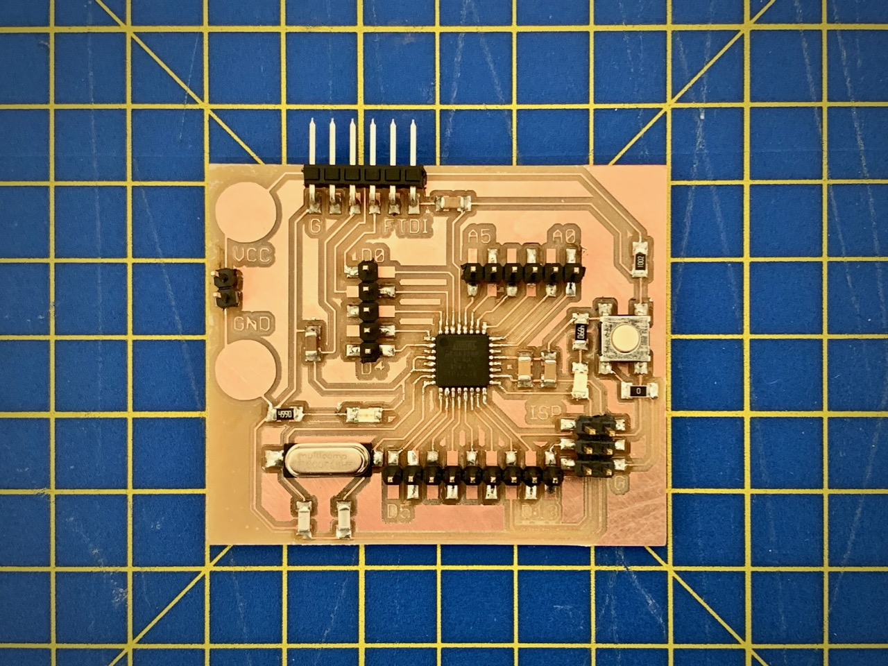
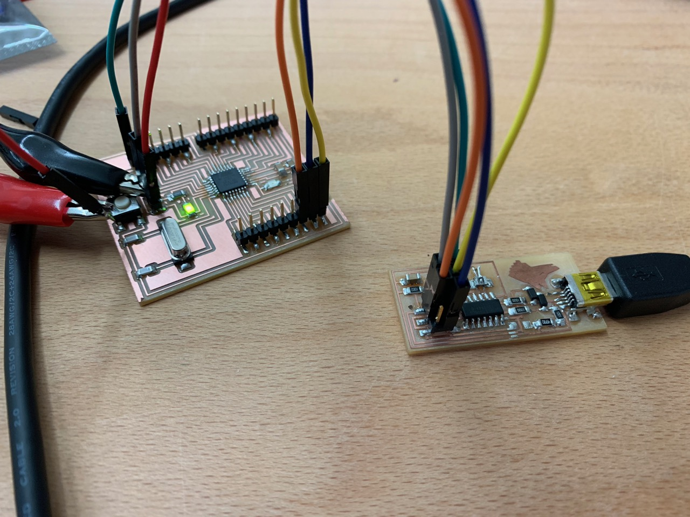
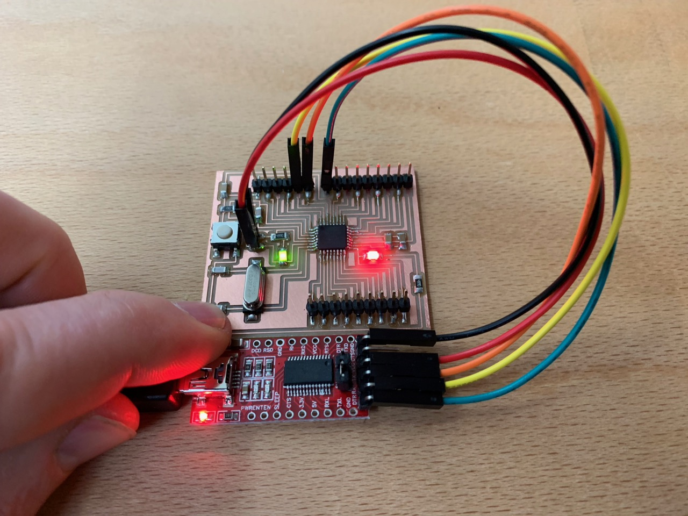
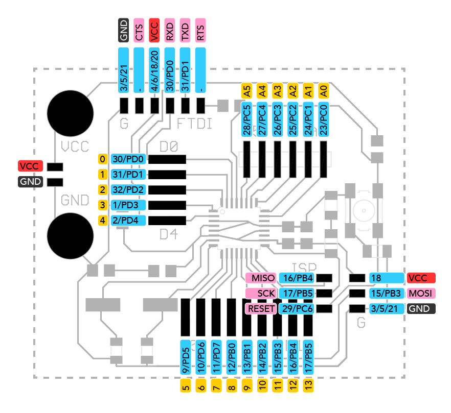
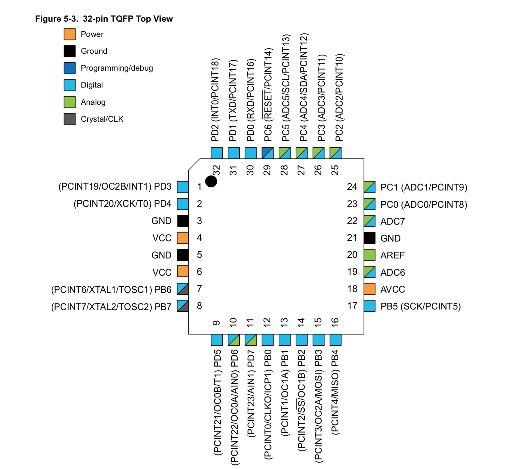

# Hello 328p!

**Hello 328p** is designed to be a 100% Arduino Uno-compatible board, that can be easily fabricated by students in a fablab. It uses the ATmega328P microcontroller and is very heavily based on [Daniele Ingrassia's Satshakit board](https://github.com/satshakit/satshakit), which also serves the same purpose. The main changes to this design are to provide a simpler way to connect things to the board through more convenient headers and labelling on the board itself.

Please read [Daniele's documentation](https://github.com/satshakit/satshakit) for full details on this board. These docs will only address the changes made.

## Background

I have spent a few months exploring different approaches to making your own Arduino-compatible board. My aim is to find (or design myself) a board that can be easily milled and stuffed by students, and then used in their own interactive projects. I also wanted to lern more about Arduino, the ATMega328p and board design in the process. 

You can read more about that here: [DIY Arduino docs](https://fablabbrighton.github.io/digital-fabrication-module/diy-arduino/)

After trying many boards is a starting point, I found Daniele's Satshakit design, which was well-documented, simple, and tested in a Fablab. I successfully made and programmed the board, but I found the hader arrangement rather unhelpful.

In this photo, I'm using my FabISP to program a Satshakit. You can see that it involves a lot of jumper wires, and that there is no simple connection between the 3x2 pin ISP header on the programmer, and the relevant pins on the target board. 

Similarly, programming using an FTDI cable or breakout board (as in the photo above) involves a non-intuitive routing of pins from the programming cable (or board) to the target.

The upside of this approach is that the board design is very simple. Almost all the pins from the microcontroller are simply exposed out to pins on headers that surround it. The traces are very straightforward.

However, that pushes some complexity back onto the user, who has to figure out which pins to connect where, when burning the bootloader, or whenever they want to program the board. I think there is a friendlier way to do this, with only a small overhead in complexity of traces.

## Hello 328p header layout

This diagram shows all the headers, and which pins on the chip they are connected to. In addition, pin functions for the FTDI and ISP headers are highlighted in pink, and the Arduino labels for analogue and digital pins are highlighted in yellow.

You may also wish to consult the official pinout for the ATmega328P chip (TQFP package) from the datasheet:

## Programming the board

Following the Satshakit instructions: 

> A satshakit board is **totally like an Arduino board**, thus is possible to use the Arduino IDE without any modification. When you finish solder satshakit, you're ready to program it. If you want to use satshakit as an Arduino, you first need to **upload Arduino bootloader**. This will also set the ATmega328P fuses as the same of an Arduino UNO.
> To do this you need to use a **programmer**, for example another Arduino or FabISP. If you plan to program a satshakit with an Arduino, be sure to upload the **Arduino as ISP skecth** before connecting the satshakit to it.

Where we diverge from the Satshakit process is that our connections are simpler. If you're using a FabISP, simply connect the ribbon cable to the ISP on both boards. the GND pin on the ISP heder is marked with a G.

To program with an FTDI cable, simply connect to the header labelled FTDI. Again, the GND pin is marked with a G.

Returning to the original instructions:

> Once everything is connected, follow these steps to upload Arduino bootloader:

> 1. open Arduino IDE
> 2. select proper programmer (for example Arduino as ISP or USBtinyISP)
> 3. select Arduino UNO as board
> 4. click on tools->Burn Bootloader

> With a satshakit cnc or satshakit laser you can use an **FTDI USB cable to upload and use you favourite sketch** without the need to use a programmer anymore.

> Remember that if you don't have an FTDI cable you always need a programmer, and to select **File->Upload using a programmer** to upload the code to satshakit.

License
--
This work is licensed under the terms of Attribution-NonCommercial-ShareAlike 4.0 International ([CC BY-NC-SA 4.0](https://creativecommons.org/licenses/by-nc-sa/4.0/)).

Disclaimer  
--

This hardware/software is provided "as is", and you use the hardware/software at your own risk. Under no circumstances shall any author be liable for direct, indirect, special, incidental, or consequential damages resulting from the use, misuse, or inability to use this hardware/software, even if the authors have been advised of the possibility of such damages.

